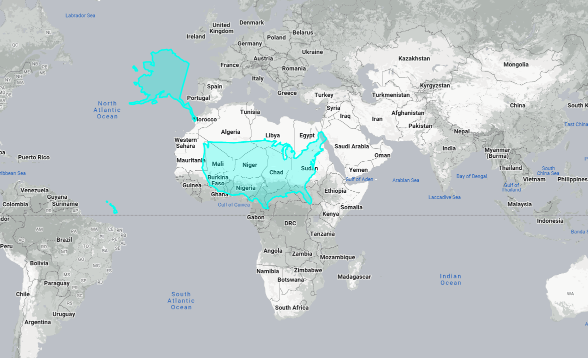

# FINAL PROJECT
## Introduction
It is famous that earth projection towards a plane makes some countries bigger than others depending on how far they are from the equator. Some developpers created a website let people compare countries (i.e www.thetruesize.com). For the final project of this class, I want to create the same but with a global world.

## Detailed Outline
Users would be able to run the binaries with the name of the country they want to compare it to the rest of the world. A phong illuminated globe would appear on the screen, with a texture of the world map. The said country is going to be elevated a over the world with hard borders and a bit transparent. The image below shows what I'm thinking about on a flat map.

The user would be able to move the country around using the keys I,J,K and L. Also, they would be able to move the globe around and zoom in and out.

## Tasks + Grading
| Done  | Task                                             | Grading |
|-------|--------------------------------------------------|---------|
|&cross;| Render Globe with borders and phong shading      | 30%     |
|&cross;| Select country and render it on top of the globe | 40%     |
|&cross;| Move country around the globe                    | 30%     |

## Additional tasks
I added more than 15% cause I will select some to do but not do them all
| Done    | Task                                                               | Grading |
|---------|--------------------------------------------------------------------|---------|
| &cross; | Multiple countries at the same time                                | 10%     |
| &cross; | Option to render worlds train network over the globe               | 5%      |
| &cross; | Upload it on the web and make it reactive with a mouse using WebGL | 15%     |